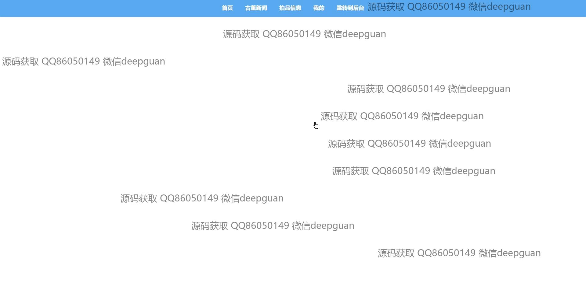
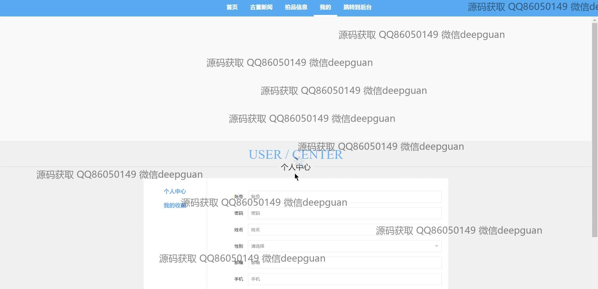
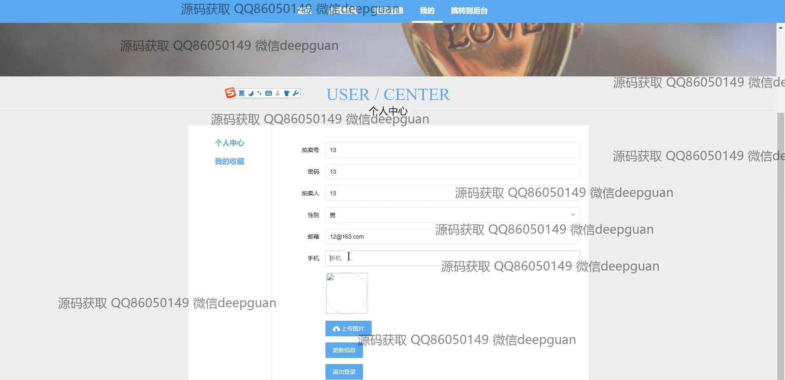
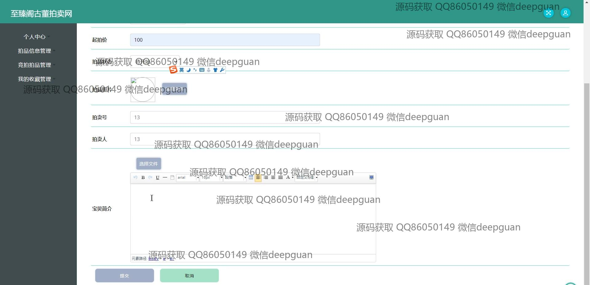

<h1 align="center">的古董拍卖网站</h1>

## 简介
古董拍卖系统：角色分为管理员、用户、拍卖家；支持拍品管理、竞拍功能、用户信息管理、新闻发布、轮播图管理及分类查询等核心功能。    --计算机毕业设计源码；毕设源码；java毕业设计源码

## 联系方式

<h3 align="center">获取完整代码与数据库文件 + 微信：deepguan QQ: 86050149 QQ群: 783742310</h3>

<h3 align="center">可帮忙远程部署 包运行成功！提供远程部署、修改代码、设计文档指导、代码讲解等服务！</h3>

## 功能介绍（完整见运行截图）
管理员：基本功能包括用户的登录、注册和账户退出。后台管理界面允许管理员查看和管理用户信息、审核拍卖品、上传和管理网站轮播图。通过左侧导航菜单，管理员可以访问用户管理、拍卖商管理以及其他系统模块。审核功能通过弹出窗口进行设定，管理员可以查看拍卖品的编号、名称、起拍价以及审核状态，并执行相应的审核操作。

用户：用户可以在网站上注册、登录和退出账户。网站首页提供导航栏，用户可以访问古董新闻、拍品信息和个人中心等模块。用户可浏览拍卖品详情，如分类、编号、起拍价和拍卖状态。个人中心功能允许用户查看和编辑个人信息，包括修改账号、密码、姓名、性别、邮箱和手机号。用户也可以参与竞拍，通过竞拍按钮快速出价并查看拍品竞拍状态。

拍卖家：拍卖家需要通过注册和登录系统进入平台，在网站后台可以上传并管理所提交的拍卖品。拍卖家可以设置拍品的分类、编号、名称及拍卖的起始和结束时间。后台功能模块允许拍卖家上传拍品图片并管理拍品的状态，查看竞拍历史以及相应审批状态。拍卖家在后台可以导航至个人中心，查看与管理个人拍卖和账户信息。

普通用户：普通用户主要通过网站前端功能进行拍卖品的浏览和竞拍活动。在个人中心，用户可查看和更新个人信息，管理已竞拍物品以及收藏夹。用户还可以通过首页指引了解最新的古董活动及拍品信息。系统提供方便的搜索功能，使用户能够快速查找到特定的拍品。用户可以参与拍卖，通过平台上的按钮实时跟踪拍卖状态和结果。

## 运行截图

本代码来源于网络,仅供学习参考使用!

